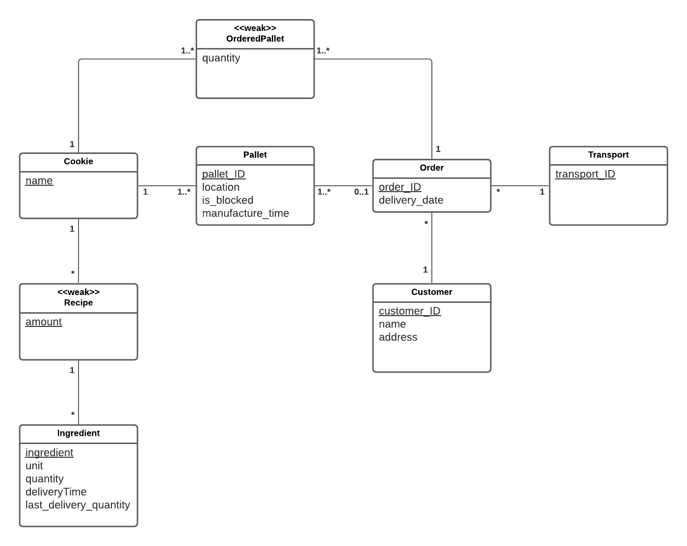

# EDAF75, project report

This is the report for

 + Jacob Lundell, `ja7516lu-s`
 + Kevin Aspen, `ke5188as-s`
 + Nova Svensson, `no8664sv-s`

We solved this project on our own.


## ER-design

The model is in the file [`er-model.png`](er-model.png):

<center>
    
</center>


## Relations

+ ingredients(**ingredient**, unit, quantity, deliveryTime, last_delivery_quantity)
+ recipes(**amount**, **_name_**, **_ingredient_**)
+ cookies(**name**)
+ pallets(**pallet_ID**, location, is_blocked, manufacture_time, _name_)
+ orders(**order_id**, delivery_date, _transport_ID_, _customer_ID_)
+ orderedPallets(**quantity**, **_name_**, **_order_ID_**,)
+ customers(**customer_ID**, name, address)
+ transports(**transport_ID**)


## Scripts to set up database

The script used to set up the database is in:

 + [`krusty.sql`](krusty.sql) (defines the tables).

So, to create the database, we run:

```shell
sqlite3 krusty.sqlite < krusty.sql
```


## How to compile and run the program

```shell
pip3 install -r requirements.txt
python3 application.py
```
